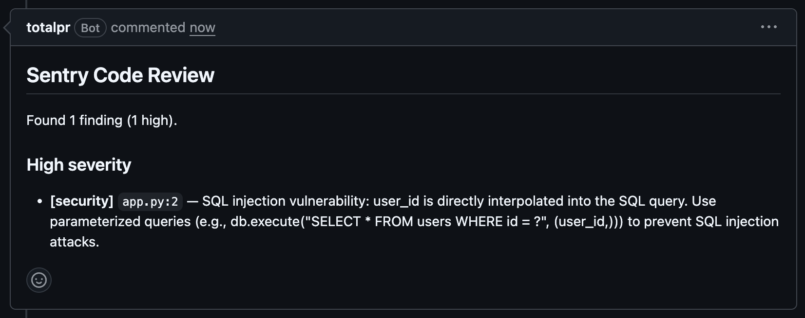
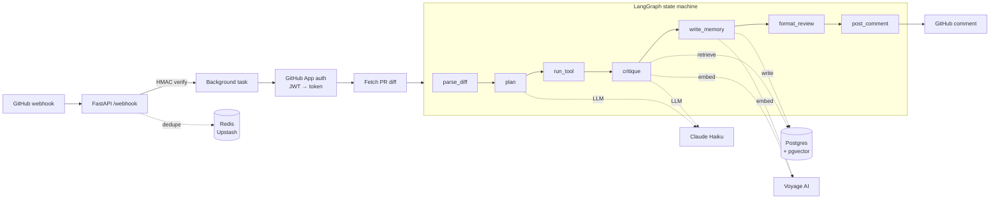

# TotalPR

I built TotalPR to learn what an agent looks like when it has to do real work. It reviews GitHub pull requests: pulls the diff, plans what to look at, calls Claude to produce structured findings, optionally checks past feedback it's gotten on similar code, and posts a review comment back to the PR. It runs on Fly.io and reviews real PRs at https://github.com/finesse2307/totalpr-test.



The interesting parts aren't the LLM calls. They're the boring parts that production agents need and side projects usually skip: a labeled eval set with a scoring harness, a pgvector memory that lets the agent learn which findings the team actually wants, tracing that turns "feels slow" into "95% of latency is the critique call" and a kill switch that I tested in production.

## What the numbers say

I ran the agent against ten labeled diffs covering SQL injection, off-by-one bugs, N+1 queries, missing null checks, hardcoded credentials, and two clean refactors that shouldn't trigger anything. The scorer matches predicted findings to expected ones by category and required-keyword presence; it tracks severity agreement as a separate metric because two engineers will reasonably disagree on whether an off-by-one is "high" or "medium," and conflating that with detection accuracy hides what's actually happening.

Latest run on Claude Haiku 4.5: **F1 0.86** (precision 0.82, recall 0.90), severity agreement **0.33**, average **$0.0055 per PR**, p95 latency **11.3s**. Total spend for the ten-case eval was about a nickel.

Two honest caveats. Ten cases is a small eval, so treat these as directional, not statistical. And the severity-agreement number is genuinely 33% — the model leans "high" where I labeled "medium" almost every time. That's interesting data, not a bug; it tells you the model and I have different defaults, and tightening either side is real work.

You can rerun this yourself: `python scripts/run_evals.py`. Reports land in `evals/results/` as JSON.

## How it works

A FastAPI service receives GitHub webhooks. It verifies the HMAC signature before parsing anything (timing-safe compare, the usual story), then schedules a background task and returns 200 — GitHub's webhook timeout is 10 seconds and a real review takes longer.

The background task builds an agent stack and runs a six-node LangGraph state machine:

```
parse_diff → plan → run_tool → critique → write_memory → format_review → post_comment
```

`plan` and `critique` are the two LLM-touching nodes. The planner gets the diff and decides which tools to invoke. The critique gets the diff, the tool output, and any retrieved past-review memories, and produces structured findings that the format node renders into markdown.

The tools are Ruff, Semgrep, ripgrep, and a small PyPI metadata lookup. Locally they run in network-isolated Docker containers (`--network=none --memory=256m`). In production on Fly's free tier there's no Docker-in-Docker, so the deployed agent reviews diffs without static-analysis help and the critique LLM works from the diff alone. That's a real limitation. The full tool stack runs in local dev and the eval harness.

Memory is the part I find most interesting. Every finding the agent produces gets written to Postgres + pgvector with an embedding of the diff (Voyage's `voyage-code-3`, 1024 dimensions) and a nullable accept/reject label. On the next PR, the critique node retrieves the K nearest labeled memories filtered by repo and prepends them to its prompt as a "Past Review Outcomes" section. I demonstrated this end-to-end: ran the agent, labeled one of its findings as rejected via a small CLI, re-ran on the same diff, watched the rejected finding stop appearing. It's a primitive feedback loop but it actually moves the model's output.

Observability is OpenTelemetry. Every node is wrapped in a span at graph-construction time, and the whole run is wrapped in an outer `review_pr` span so a trace reads as one tree. There's no exporter wired up yet — spans go to stdout in dev — but the instrumentation is in the right place to point at Grafana Cloud later.

### The pipeline at a glance



## Stack

Python 3.12, FastAPI, LangGraph, Pydantic. Anthropic Claude Haiku 4.5 for the agent calls, Voyage AI for embeddings. Postgres + pgvector for memory (Neon-hosted in production), Redis for webhook deduplication (Upstash-hosted). Docker for sandboxing tools locally. OpenTelemetry for traces. Fly.io for the service deployment. All managed services on their free tiers — monthly cost at idle is zero.

## Layout

```
src/sentry/
  api/          FastAPI webhook handler + background dispatch
  github/       App auth (JWT → installation token), REST client, comment poster
  nodes/        LangGraph nodes
  tools/        Sandboxed tool wrappers
  memory.py     pgvector-backed MemoryStore with similarity retrieval
  embedding.py  EmbeddingClient protocol + Voyage AI implementation
  anthropic_client.py, budget.py, cache.py    Composable LLM client stack
  graph.py      Wires the six nodes together
  telemetry.py  OpenTelemetry tracer + with_span wrapper
  workspace.py  Materializes a diff into a temp dir for tools
evals/          Labeled eval set + scoring harness
migrations/     Postgres schema (idempotent, IF NOT EXISTS)
scripts/        Smoke runner, eval runner, memory labeling CLI, DB init
tests/          165 tests (168 with Postgres)
```

## Running it

```
docker compose up -d postgres
python -m venv .venv && source .venv/bin/activate
pip install -e ".[dev]"
python scripts/init_db.py
python scripts/run_smoke.py case-001
```

The smoke runner takes a case ID from the eval set and runs it through the full graph with a real LLM call. `--memory` enables pgvector retrieval and writing. `--trace` prints OpenTelemetry spans to stdout. Each run costs ~$0.005.

To exercise the memory loop end-to-end:

```
python scripts/run_smoke.py case-010 --memory       # produces unlabeled memories
python scripts/label_memory.py --repo local/smoke   # interactive labeling
python scripts/run_smoke.py case-010 --memory       # re-runs with the labels applied
```

## Deployment

```
fly deploy
```

The kill switch is `fly secrets set REVIEWS_ENABLED=false`. Setting it triggers a redeploy; the next webhook logs `dispatch decision: False (reviews disabled by kill switch)` and stops. I tested this in production after the initial deploy: pushed a commit with reviews disabled, confirmed the agent silently no-op'd, then unset the secret and pushed again to confirm normal operation returned. The unset-and-test took about a minute.

## What I'd change

The memory store should batch-embed across recent PRs of the same repo at cold start, not just within a single review batch. Otherwise a fresh install has nothing to retrieve from on its first dozen runs.

The eval scorer is too strict in one direction. When the agent produces a real finding that wasn't in the labels (the file-handle bug it found in case-010), it gets counted as a false positive. Three honest options: expand the labels, add a third "acceptable but unlabeled" tier, or accept that the precision metric is a slight under-estimate. I chose to backfill the labels.

The trace exporter isn't wired to Grafana Cloud. The collector setup is in place; pointing it at a real backend is one function call and a credential I haven't set up. Phase-2 work.

Severity calibration is the most interesting open problem. The model's defaults disagree with mine 67% of the time on findings we both agree exist. Resolving this is either a prompt-engineering pass (give the model the rubric explicitly), a labels pass (relax the rubric to match the model), or a separate calibration model. I haven't decided.

## Verifying it works

```
pytest -v
ruff check src tests
mypy src tests
```

165 tests (168 with Postgres), lint-clean, mypy-clean. The Postgres integration tests skip when no database is reachable, so CI without Postgres still passes. The eval harness is the more interesting verification — it's the only one that uses real Anthropic credits.

## Credentials and security

Tools run with `--network=none` locally so a malicious PR can't make outbound connections from the analysis sandbox. Webhook signatures are verified with constant-time HMAC compare before any payload parsing. The Anthropic budget tracker caps spend per invocation. All production credentials live in Fly secrets — none in the repo, none in the container image, none in commit messages.

I rotated three credentials during the deploy phase after discovering that error logs can leak them (the redis URL parser includes the full URL in `ValueError` messages, and the Anthropic key showed up in an httpx connection error). The fix going forward is a logging filter for credential patterns, which I haven't added yet. Worth mentioning because it's exactly the kind of thing that breaks down in real deploys.